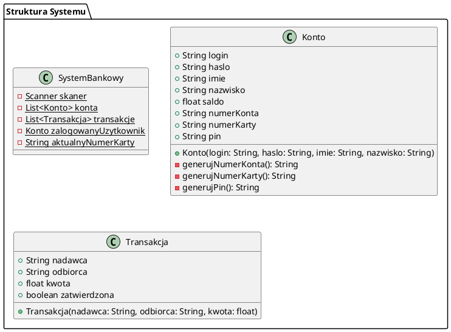
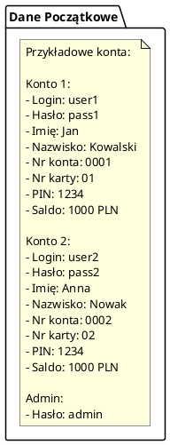
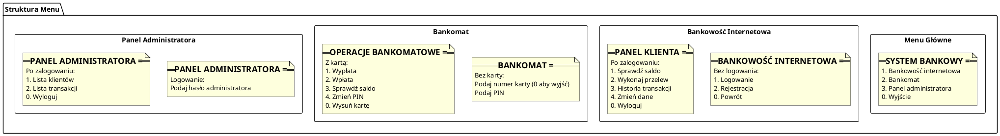
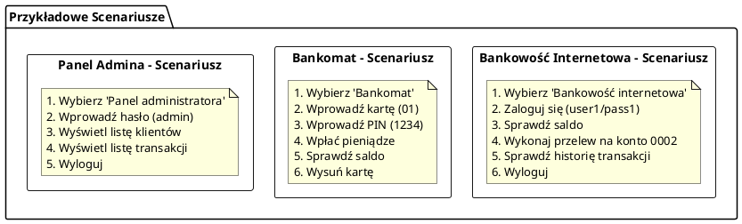

# System Bankowy

Prosty system bankowy implementujący podstawowe funkcje bankowości internetowej i obsługi bankomatu.

## Struktura Systemu



## Dane Początkowe



## Struktura Menu



## Przykładowe Scenariusze Użycia



## Jak uruchomić

1. Skompiluj plik `Bank.java`:
```bash
javac Bank.java
```

2. Uruchom program:
```bash
java Bank
```

## Funkcjonalności

- Bankowość internetowa (przelewy, sprawdzanie salda, historia transakcji)
- Obsługa bankomatu (wpłaty, wypłaty, zmiana PIN)
- Panel administratora (podgląd klientów i transakcji)

## Dane testowe

- Konto 1: login: user1, hasło: pass1
- Konto 2: login: user2, hasło: pass2
- Admin: hasło: admin
